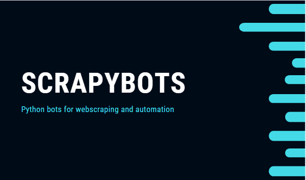

Scrapybots Documentation
=========================
<!--ts-->
* [Getting started with Scrapybots](#getting-started-with-scrapybots)
  * [Requirements](#requirements)
  * [Setup](#setup)
    * [Selenium](#selenium)
    * [Pyautogui](#pyautogui)
    * [Openpyxl](#openpyxl)
    * [Pandas](#pandas)
  * [Webdriver](#webdriver)
    * [Webdriver Issues](#webdriver-issues)
* [Maintained Projects](#maintained-projects)
* [References](#references)
<!--te-->

---

<h3 align="center"> 

</h3>

<p align="center">
  <a href="https://www.linkedin.com/in/vitoria-pecanha/">
    
  </a>

  
  
  
  
  

  <a href="https://github.com/vitoriape/scrapybots/blob/main/LICENSE">
    
  </a>
  
  <a href="https://github.com/vitoriape/scrapybots/commits/main">
    
  </a>
	
  <a href="https://github.com/vitoriape/scrapybots/archive/refs/heads/main.zip">
    
  </a>

  <a href="https://github.com/vitoriape/ConsprocBot/releases">
    
  </a>
</p>

---
---

## **Getting started with Scrapybots**
ConsprocBot é um software de automação criado com Python. Ele foi desenvolvido para realizar webscraping em sites municipais de Andamento de Processos, anexando os mesmos em bases de dados mantidas com Excel.

### **Requirements**

<table><thead><tr><th>Minimum</th><th>Recommended</th></tr></thead><tbody><tr><td>Requer um processador e um sistema operacional Windows ou Linux</td><td>Requer um processador e um sistema operacional Windows ou Linux</td></tr><tr><td>Kernel: <a href="https://www.python.org/downloads/release/python-370/" target="_blank" rel="noopener noreferrer">Python 3.7.0</a></td><td>Kernel: <a href="https://www.python.org/downloads/release/python-397/" target="_blank" rel="noopener noreferrer">Python 3.10.4</a></td></tr><tr><td>Libraries: pyautogui, selenium, openpyxl e os</td><td>Libraries: pyautogui, selenium, msedge.selenium_tools, openpyxl e os</td></tr><tr><td>Drivers: any webdriver</td><td>Drivers: Edge webdriver</td></tr></tbody></table>

---

### **Setup**
Certifique-se de possuir todas as bibliotecas necessárias instaladas e atualizdas antes de executar os scripts dos bots. Instale usando os comandos `py -m pip install <nomedabiblioteca>` ou `pip install <nomedabiblioteca>`, dependendo da forma como o Python está configurado na sua máquina.

#### **Selenium**
`Framework para teste de aplicativos WEB.` 
```python
pip install selenium
```

#### **Pyautogui**
`Módulo de automação de GUI para Python2 e Pyhon3.`
```python
pip install pyautogui
```

#### **Openpyxl**
`Permite a leitura e escrita em arquivos do Excel 2010.`
```python
pip install openpyxl
```

#### **Pandas**
`Manipula tabelas e séries temporais, analisando dados.`
```python
pip install pandas
```


**Afim de facilitar o uso dos RPA's, adicione o executável Python que você utiliza dentro da variável `PATH` do seu sistema.**

<p align="center">

</p>

```cmd
python filename.py
```

---

### **Webdriver**
Faça o download do webdriver de acordo com o navegador de sua preferência e, para executar o mesmo através da biblioteca `selenium`, também adicione o mesmo na variável `PATH` do sistema, conforme orientado na seção [Setup](#setup). 

#### **Webdriver Issues**
Caso as configurações anteriores não funcionem e você comece a receber erros na execução do webdriver, faça o seguinte:

**I. Instale a biblioteca msedge.selenium_tools**
```cmd
pip install msedge.selenium_tools
```

**II. Importe as bibliotecas necessárias**
```python
from selenium import webdriver
from msedge.selenium_tools import EdgeOptions
from msedge.selenium_tools import Edge
```

**III. Reconfigure o local com o webdriver executável**
```python
edge_options = EdgeOptions()
edge_options.use_chromium = True
nav = Edge(executable_path=r'C:\localondeoarquivoestasalvo\msedgedriver.exe', 
            options=edge_options)
```

---

## **Maintained Projects**
<p align="left"> 
	<a href="https://progress-bar.dev/100/">
  </a>
<p>
	
- [consprocbot](./consprocbot/): Obtém atualizações em sites municipais para acompanhar andamento de processos
- [dwloopbot](./dwloopbot/): Download em massa de arquivos mantidos em páginas de cursos online
- [sellsdatapy](./sellsdatapy/): Webscraping de sites de vendas

---

## **References**
<table><thead><tr><th>Documentation</th><th>Downloads</th></tr></thead><tbody><tr><td><a href="https://docs.python.org/3/" target="_blank" rel="noopener noreferrer">Python 3.10.4 documentation</a></td><td><a href="https://www.python.org/downloads/" target="_blank" rel="noopener noreferrer">Python</a></td></tr><tr><td><a href="https://docs.microsoft.com/pt-br/microsoft-edge/webdriver-chromium/" target="_blank" rel="noopener noreferrer">Use o WebDriver para automatizar o Microsoft Edge</a></td><td><a href="https://docs.microsoft.com/pt-br/microsoft-edge/webdriver-chromium/?tabs=c-sharp#download-microsoft-edge-driver" target="_blank" rel="noopener noreferrer">Download Microsoft Edge Webdriver</a></td></tr></tbody></table>

---
---